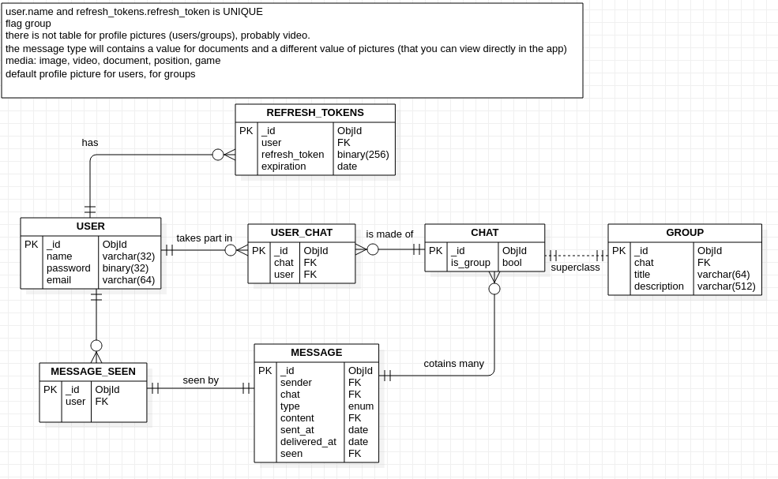

# Project structure

## Client
- Interface structure (HTML structure, single page, EJS views)
- UI (CSS, page structure)
- JavaScript (views, router, API client, Socket client, axios)

## Backend
- Express (EJS compiler, package, routes)
- Socket IO
- Log in / Sign up (PassportJS)

## Database Server
- MongoDB
- 

## Features
- Homepage
- Aliases for users
- Log in / Sign up

### Axios
Regarding axios, all content in request body is automatically converted in JSON and sent as it.
Same thing happens when receiving a response, the response body is automatically parsed from JSON to a JS object.
To change this behaviour, you can use the third parameter in axios request alias `config`.
from the [axios documentation](https://github.com/axios/axios) section `Features`.

### Socket IO
Regarding socket.io:
`There is no need to run JSON.stringify() on objects as it will be done for you.`
from [socket.io docs](https://socket.io/docs/v3/emitting-events/)

